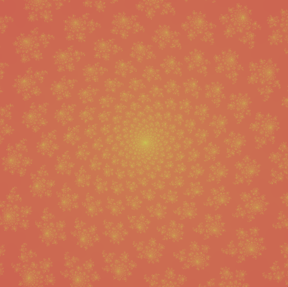
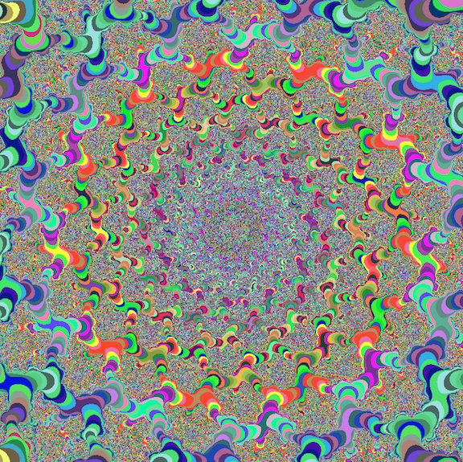
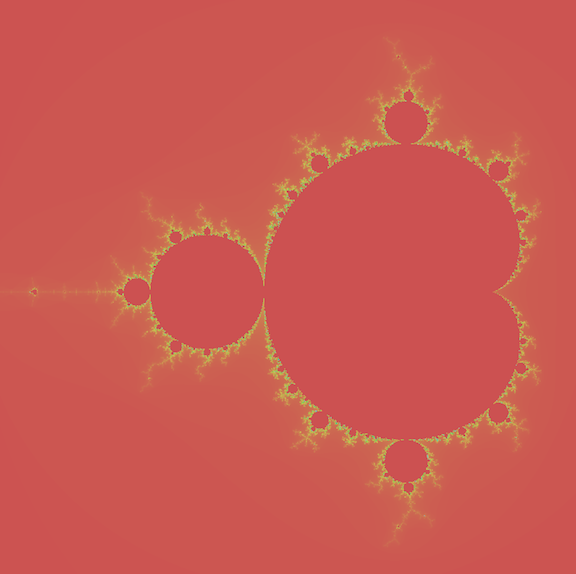
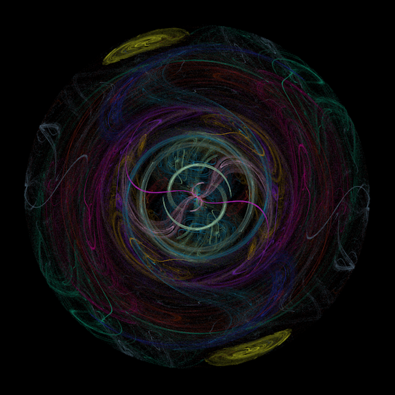
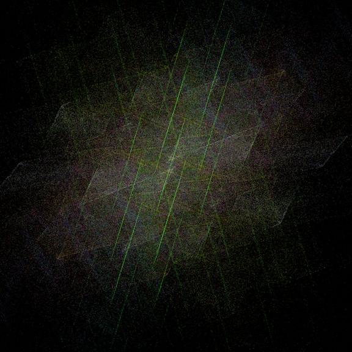
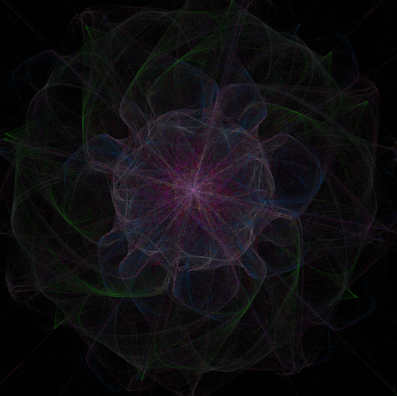

# Fractal Machine

## About

This program will create julia, mandelbrot and a variety of flame fractals. A user can switch between modes with the keys and zoom with the mouse. Additonal user features are implemented and discussed below. This project is part of the [42 Silicon Valley](42.us.org) curriculum and was expanded on to include multithreading for all fractals and the addition of flame fractals.

## Installation
*Note: This was compiled on and run on Mac OS 10.13, 2015, 3.2 GHz Intel Core i5*
1. Clone the source with git:
   ```bash
   git clone https://github.com/tfdiaz/fractal
   cd fractal
   ```
2. Compile and Run
   ```bash
    make && make clean
    ./fractol
    ```
If you run into any issues let me know.

## User Guide

### List of Commands
* Mouse - Zoom
* *Key* 1 - Julia Mode
  * *Key* F - Freeze/unfreeze Julia set with movement from mouse
* *Key* 2 - Mandelbrot Mode
* *Key* 3 - Flame Mode
  * *Key* N - Cyclic flame function
  * *Key* S - Stop flame randomization
  * *Key* A - New flame image
  * *Key* UP Arrow - Increase flame samples
  * *Key* DOWN Arrow - Decrease flame samples
  * *Key* RIGHT Arrow - Increase flame rotation
  * *Key* LEFT Arrow - Decrease flame rotation
* *Key* R - Reset
* *Key* H - Hide/Show Help
* *Key* W - Toggle Smooth/Crazy color for Julia and Mandelbrot
* *Key* +/- - Increase/Decrease iteration for Julia and Mandelbrot
* *Key* ESC - Close Window

## Image Gallery
*Just a few of the endless amount of interesting images you can create*



*Mode: 1 - high iterations - smooth coloring*



*Mode: 1 - high iterations - crazy coloring*

**The same spot as image above just different coloring mode!**



*Mode: 2 - Default iterations - smooth coloring*



*Mode: 3 - High Sample - More Rotations*



*Mode: 3 - High Sample - More Rotations*



*Mode: 3 - High Sample - More Rotations*
